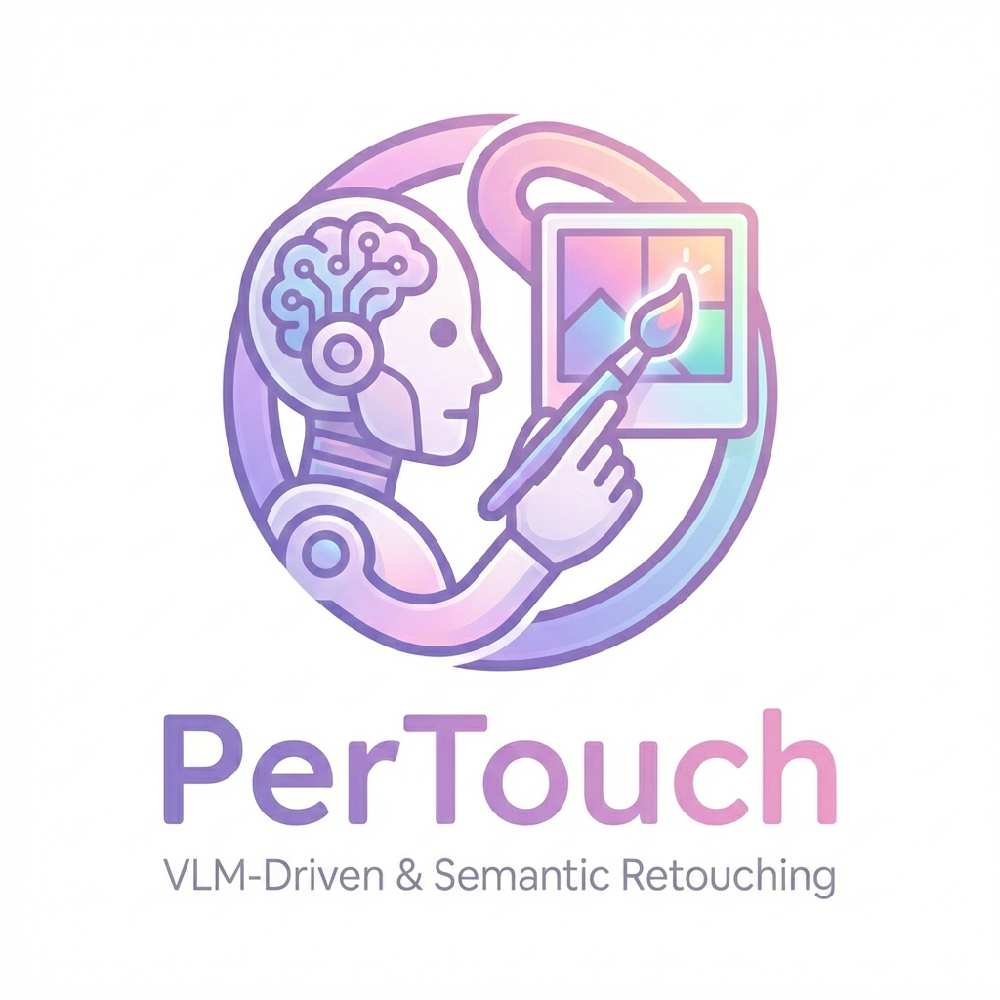

<div align="center">

<p align="center">
    
</p>

<h1 align="center">[AAAI 2026] PerTouch: VLM-Driven Agent for Personalized and Semantic Image Retouching</h1>

<p align="center">
   Zewei Chang, Zheng-Peng Duan, Jianxing Zhang, <a href="https://mmcheng.net/clguo/">Chun-Le Guo</a>, Siyu Liu<br>Hyungju Chun, Hyunhee Park, Zikun Liu, <a href="https://li-chongyi.github.io/">Chongyi Li<sup>†</sup></a>
</p>

<p align="center">
  †Corresponding Author
</p>
<!-- <p align="center">
    <span style="color: #000000ff;">VCIP, Nankai University&nbsp; &nbsp; &nbsp; &nbsp;  SRC - B</span>
</p> -->

<p align="center">
    <a href="https://arxiv.org/abs/2511.12998"></a>
   <!-- <a href='https://huggingface.co/JiachenFu/Qwen2-0.5B-detectanyllm-detector-en'></a> -->
    <!-- <a href="https://huggingface.co/spaces/JiachenFu/DetectAnyLLM"></a> -->
    <a href="https://auroral703.github.io/PerTouch/"></a>
</p>

</div>

## 📜 Abstract

Image retouching aims to enhance visual quality while aligning with users' personalized aesthetic preferences. To address the challenge of **balancing controllability and subjectivity**, we propose a unified diffusion-based image retouching framework called **PerTouch**.

Our method supports semantic-level image retouching while maintaining global aesthetics. Using parameter maps containing attribute values in specific semantic regions as input, PerTouch constructs an explicit **parameter-to-image** mapping for fine-grained image retouching. To improve semantic boundary perception, we introduce **semantic replacement** and **parameter perturbation mechanisms** during training.

To connect natural language instructions with visual control, we develop a **VLM-Driven agent** to handle both strong and weak user instructions. Equipped with mechanisms of **feedback-driven rethinking** and **scene-aware memory**, PerTouch better aligns with user intent and captures long-term preferences.

<div align="center">
    
</div>

⭐ If PerTouch is helpful to your projects, please help star this repo. Thank you! 👈

---

## 📖 Table of Contents
- [🔥 News](#-news)
- [🛠️ Dependencies and Installation](#-dependencies-and-installation)
- [🚀 Training](#-training)
- [📝 Citation](#-citation)
- [TODO](#-todo)

---

## 🔥 News
- **[2026-1-23]** 🎉 The training code of **PerTouch** diffusion backbone is released!
- **[2025-11-17]** 🚀 Our paper **PerTouch** has been released at [Arxiv](https://arxiv.org/abs/2511.12998)!
- **[2025-11-08]** 📝 Our paper **PerTouch: VLM-Driven Agent for Personalized and Semantic Image Retouching** is accepted by **AAAI 2026**!

## 🛠️ Dependencies and Installation
1.  **Clone the repository and navigate to the project directory:**
    ```bash
    git clone https://github.com/Auroral703/PerTouch.git
    cd PerTouch
    ```
2.  **Create and activate the conda environment:**
    ```bash
    conda env create -f environment.yaml
    conda activate PerTouch
    ```
<!-- 4.  **Download necessary models:**
    ```bash
    sh scripts/download_model.sh
    ```
    > If you want to reproduce all experiments reported in our paper, please go to ```./scripts/download_model.sh``` and revise it following the guidance provided by common.

    > If you have trouble downloading, try to set the environment variable before downloading:
    ```bash
    export HF_ENDPOINT="https://hf-mirror.com"
    ``` -->

## 🚀 Training

Edit hyperparameters in `train.sh` if needed, then run:

```bash
./train.sh
```

*Note: The script is compatible with Weights & Biases (wandb) for logging; make sure the environment is properly configured.*

<!-- ### 🚂 Train DDL
**[GPU memory cost: ~11G]**
```bash
# Login to wandb
wandb login
# or
# export WANDB_MODE=offline
sh scripts/train.sh
```

### 📊 Evaluation
**[GPU memory cost: ~15G]**

**Make sure you have trained DDL or downloaded checkpoints.**
```bash
sh scripts/eval.sh
```
The results will be saved in ```./results```.

### ⚙️ Reproduce Other Methods
**Make sure you have downloaded all models in `download_model.sh`.**
```bash
sh scripts/other_method/eval_${METHOD}.sh
```
`METHOD` is the method you want to reproduce.

For example, to reproduce Fast-DetectGPT, run:
```bash
sh scripts/other_method/eval_fast_det_gpt.sh
```
> **Note:** To reproduce DetectGPT and NPR, you should run the following code first:
```bash
sh scripts/other_method/generate_perturbs.sh
``` -->

---

## 📝 Citation

If you find our work useful, please consider citing:
```bibtex
@inproceedings{chang2026pertouch,
    title     = {PerTouch: A Unified Diffusion-based Image Retouching Framework with VLM-driven Agent},
    author    = {Chang, Zewei and Duan, Zheng-Peng and Zhang, Jianxing and others},
    year      = 2026,
    booktitle = {The 40th Annual AAAI Conference on Artificial Intelligence},
    address   = {Singapore, Singapore},
}
```

## TODO

- [ ] Code of Dataset Preparation and Training Data.
- [ ] Trained weights of our PerTouch.
- [ ] VLM-Driven Agent Code and Gradio.
- [ ] Online Demo.